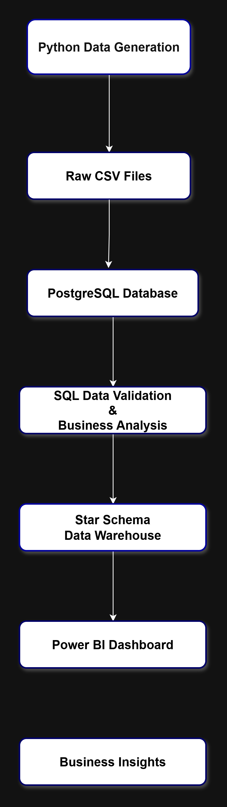
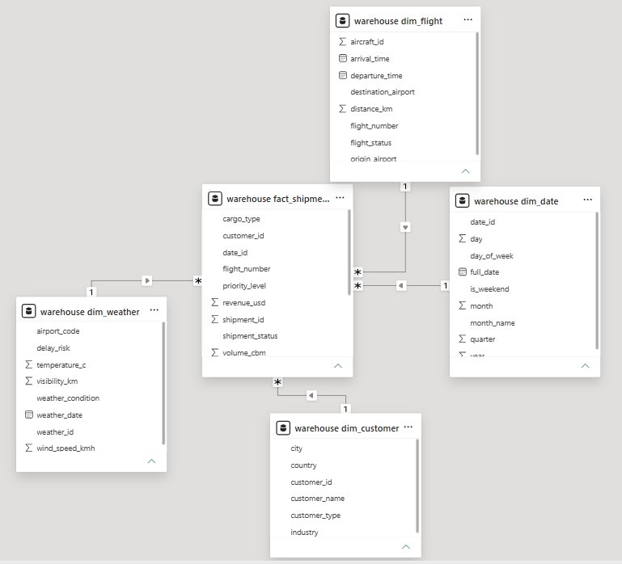

# ✈️ Air Cargo Analytics

An end-to-end **Air Cargo Analytics** platform built using **Python, PostgreSQL, SQL, and Power BI** to simulate realistic air cargo operations, design a dimensional data warehouse, and deliver interactive business intelligence dashboards for operational and strategic decision-making.

This project demonstrates the complete data analytics lifecycle—from synthetic data generation and database design to SQL analysis, dimensional modeling, and executive dashboard development.

---

## 🛠️ Technology Stack

| Category | Technologies |
|----------|--------------|
| Programming | Python |
| Database | PostgreSQL |
| Query Language | SQL |
| Data Warehouse | Star Schema |
| Business Intelligence | Power BI |
| Data Analysis | DAX |
| Libraries | Pandas, NumPy, Faker |
| Version Control | Git & GitHub |

---

## 📌 Project Highlights

- Generated **75,000 realistic cargo shipment records** using Python.
- Designed a **normalized PostgreSQL relational database**.
- Built a **Star Schema Data Warehouse** optimized for analytical reporting.
- Developed SQL queries for data validation and business analysis.
- Created interactive **Power BI dashboards** using DAX measures.
- Delivered executive and customer-focused dashboards for business decision-making.

---

# 🎯 Business Problem

Air cargo companies manage thousands of shipments daily across multiple customers, industries, cargo types, and flight routes. Decision-makers require timely insights into shipment performance, revenue trends, customer behavior, and operational efficiency to optimize logistics and maximize profitability.

Operational databases are designed for transaction processing rather than analytical reporting. This project addresses that challenge by building a complete analytics pipeline that transforms operational data into meaningful business intelligence.

---

# 🎯 Project Objectives

The objective of this project was to simulate a real-world air cargo analytics environment by:

- Generating realistic cargo shipment data
- Designing a normalized PostgreSQL database
- Building a Star Schema data warehouse
- Writing SQL queries for business analysis
- Creating interactive Power BI dashboards
- Delivering actionable business insights through data visualization

---

# 🏗️ Project Architecture

The project follows an end-to-end analytics workflow from synthetic data generation to interactive business intelligence dashboards.



---

# ⭐ Star Schema Data Model

The analytical data warehouse follows a **Star Schema** consisting of one fact table and four dimension tables.

### Fact Table

- warehouse_fact_shipments

### Dimension Tables

- warehouse_dim_customer
- warehouse_dim_flight
- warehouse_dim_weather
- warehouse_dim_date



---

# 📊 Dashboard Preview

## Executive Dashboard

Provides a high-level overview of cargo operations through key performance indicators, shipment status, revenue trends, cargo distribution, and shipment priority analysis.


---

## Customer & Industry Insights Dashboard

Focuses on customer performance, industry revenue contribution, shipment distribution, cargo weight analysis, and customer segmentation.


---

# 💡 Key Business Insights

- Simulated over **75,000 cargo shipments**.
- Generated approximately **$670M** in total revenue.
- Transported approximately **179.8K tonnes** of cargo.
- Average revenue per shipment exceeded **$8.9K**.
- Delivered shipments accounted for nearly **78%** of all shipments.
- Manufacturing and Automotive industries generated the highest revenue.
- Medium-priority shipments represented the largest shipment category.
- Monthly revenue remained relatively stable throughout the year.
- Enterprise and SME customers contributed the highest overall revenue.

---

# 📂 Project Structure

```text
air-cargo-analytics/
│
├── data/
│   ├── raw/
│   └── reference/
│
├── docs/
│   ├── architecture.png
│   └── star_schema.png
│
├── powerbi/
│   └── Air Cargo Analytics.pbix
│
├── python/
│   ├── generate_data.py
│   └── ...
│
├── sql/
│   ├── schema.sql
│   ├── warehouse.sql
│   └── analysis_queries.sql
│
├── Screenshots/
│   ├── dashboard1.png
│   └── dashboard2.png
│
├── README.md
└── .gitignore
```

---

# 🚀 Getting Started

### 1. Clone the repository

```bash
git clone https://github.com/krishx46/air-cargo-analytics
```

### 2. Navigate to the project

```bash
cd air-cargo-analytics
```

### 3. Create a virtual environment

```bash
python -m venv venv
```

### 4. Activate the virtual environment

Windows

```bash
venv\Scripts\activate
```

macOS / Linux

```bash
source venv/bin/activate
```

### 5. Install dependencies

```bash
pip install -r requirements.txt
```

### 6. Generate the datasets

Run the Python scripts to generate synthetic cargo datasets.

### 7. Import the CSV files into PostgreSQL

Execute the SQL scripts located inside the **sql** folder.

### 8. Open the Power BI report

Open the **Air Cargo Analytics.pbix** file to explore the dashboards.

---

# 🔮 Future Improvements

- Integrate real airline cargo datasets.
- Automate ETL pipelines using Apache Airflow.
- Publish dashboards using Power BI Service.
- Build predictive models for shipment delays.
- Add revenue and demand forecasting.
- Create role-based dashboard views.

---

# 📚 Skills Demonstrated

- Data Modeling
- Relational Database Design
- Star Schema Design
- SQL Querying
- Data Warehousing
- Python Data Generation
- Data Cleaning
- Data Validation
- Business Intelligence
- DAX Measures
- Dashboard Design
- Data Visualization
- Git & GitHub

---

# 👨‍💻 Author

**KD**

Bachelor of Technology in Computer Science (Artificial Intelligence & Machine Learning)

GitHub: https://github.com/krishx46

LinkedIn: https://www.linkedin.com/in/krishnadevgokul/

---

## 📝 Note

This project uses **synthetically generated data** created solely for educational and portfolio purposes. It is designed to demonstrate end-to-end data analytics, dimensional modeling, SQL analysis, data warehousing, and Power BI reporting workflows. The dataset does not represent operational data from any airline or logistics company.


